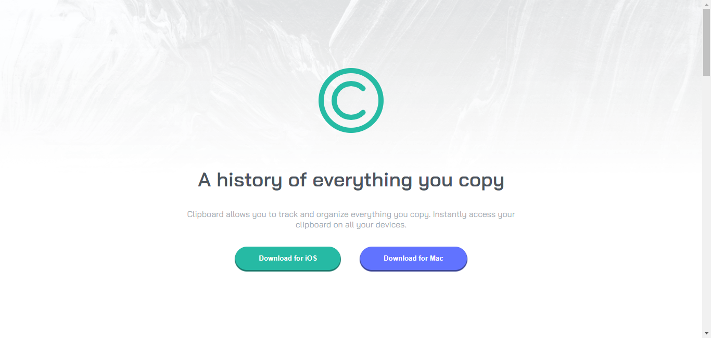

# Frontend Mentor - Clipboard landing page solution

This is a solution to the [Clipboard landing page challenge on Frontend Mentor](https://www.frontendmentor.io/challenges/clipboard-landing-page-5cc9bccd6c4c91111378ecb9). Frontend Mentor challenges help you improve your coding skills by building realistic projects. 

## Table of contents

- [Overview](#overview)
  - [The challenge](#the-challenge)
  - [Screenshot](#screenshot)
  - [Links](#links)
- [My process](#my-process)
  - [Built with](#built-with)
  - [What I learned](#what-i-learned)
  - [Continued development](#continued-development)
  - [Useful resources](#useful-resources)
- [Author](#author)

## Overview

### The challenge

Users should be able to:

- View the optimal layout for the site depending on their device's screen size
- See hover states for all interactive elements on the page

### Screenshot

### Links

- Solution URL: [https://github.com/ledoux25/CLIPBOARD-LANDING-PAGE](https://your-solution-url.com)
- Live Site URL: [https://ledoux25.github.io/CLIPBOARD-LANDING-PAGE/](https://your-live-site-url.com)

## My process

### Built with

- Semantic HTML5 markup
- CSS custom properties
- Flexbox
- CSS Grid
- SCSS

### What I learned

I learned how to easyli do responsive design with the use of flexbox and grid

### Continued development

Now i'm fully confident about my css skills i'm starting my javascript course tonight along side a anothe challenge

### Useful resources

- [https://fonts.google.com/specimen/Bai+Jamjuree](https://fonts.google.com/specimen/Bai+Jamjuree) - To acces the font nessary for this challenge

## Author

- Frontend Mentor - [@ledoux25](https://www.frontendmentor.io/profile/ledoux25)
- Twitter - [@SanguoLedo15304](https://https://twitter.com/SanguoLedo15304)

